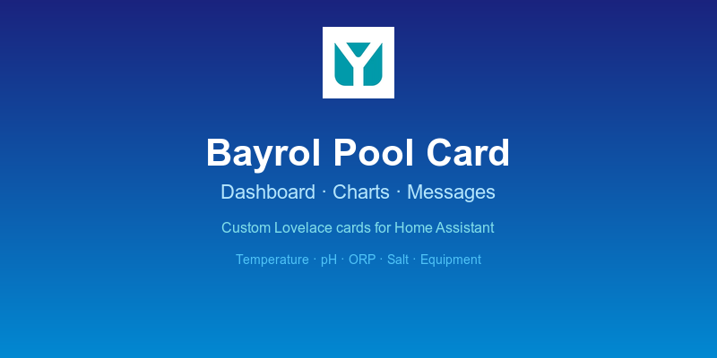
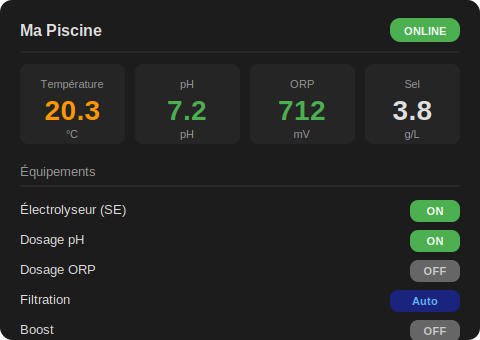
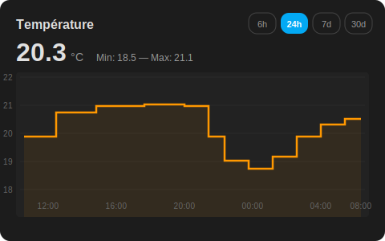
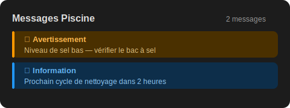
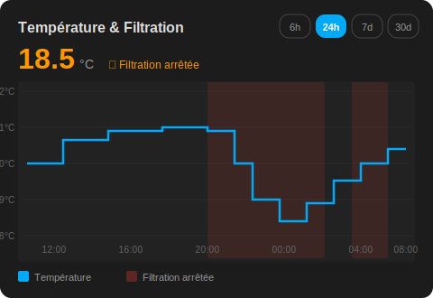

# Bayrol Pool Card



Custom Lovelace cards for [Bayrol Pool Access](https://github.com/tdenolle/bayrol-poolaccess-mqtt) — integrate your pool data into any Home Assistant dashboard.

## Cards

### `bayrol-pool-dashboard-card`

Full pool overview: temperature, pH, ORP, salt, status, and equipment controls.

```yaml
type: custom:bayrol-pool-dashboard-card
device_serial: "YOUR_SERIAL"
title: Ma Piscine          # optional
show_equipment: true       # optional (default: true)
```



### `bayrol-pool-chart-card`

Historical chart for any pool entity with period selector (6h / 24h / 7d / 30d).

```yaml
type: custom:bayrol-pool-chart-card
device_serial: "YOUR_SERIAL"
entity_key: temperature    # matches entity key from bayrol-poolaccess-mqtt
title: Température         # optional
unit: "°C"                 # optional (auto-detected from entity)
color: "#ff9800"           # optional
```



### `bayrol-pool-messages-card`

Displays pool alerts and messages using native `ha-alert` components.

```yaml
type: custom:bayrol-pool-messages-card
device_serial: "YOUR_SERIAL"
title: Messages Piscine    # optional
```



### `bayrol-pool-temp-chart-card`

Temperature chart with filtration status overlay. Highlights periods when filtration is off — temperature readings are unreliable during these periods.

```yaml
type: custom:bayrol-pool-temp-chart-card
device_serial: "YOUR_SERIAL"
title: Température         # optional
color: "#03a9f4"           # optional (temperature line color)
filtration_off_color: "rgba(244, 67, 54, 0.15)"  # optional (background for filtration off)
```



### Full dashboard example

Multiple cards can be combined in a HA grid/stack:

```yaml
type: vertical-stack
cards:
  - type: custom:bayrol-pool-dashboard-card
    device_serial: "YOUR_SERIAL"
  - type: horizontal-stack
    cards:
      - type: custom:bayrol-pool-chart-card
        device_serial: "YOUR_SERIAL"
        entity_key: temperature
        title: Température
        color: "#ff9800"
      - type: custom:bayrol-pool-chart-card
        device_serial: "YOUR_SERIAL"
        entity_key: ph
        title: pH
        color: "#66bb6a"
  - type: custom:bayrol-pool-chart-card
    device_serial: "YOUR_SERIAL"
    entity_key: mv_se
    title: ORP / Redox
    color: "#4fc3f7"
  - type: custom:bayrol-pool-messages-card
    device_serial: "YOUR_SERIAL"
    title: Messages
  - type: custom:bayrol-pool-temp-chart-card
    device_serial: "YOUR_SERIAL"
    title: Température & Filtration
```

## Installation

### HACS (recommended)

1. Add this repository as a **custom repository** in HACS (type: Lovelace)
2. Search for "Bayrol Pool Card" and install
3. Refresh your browser

### Manual

1. Download `bayrol-pool-card.js` from the [latest release](https://github.com/tdenolle/bayrol-pool-card/releases)
2. Copy to `/config/www/bayrol-pool-card.js`
3. Add the resource in HA:
   - **Settings → Dashboards → Resources → Add**
   - URL: `/local/bayrol-pool-card.js`
   - Type: JavaScript Module

## Development

```bash
npm install
npm run build     # single build
npm run watch     # rebuild on changes
```

## Requirements

- Home Assistant 2024.1.0+
- [Bayrol Pool Access MQTT](https://github.com/tdenolle/bayrol-poolaccess-mqtt) addon installed and configured

## License

MIT
